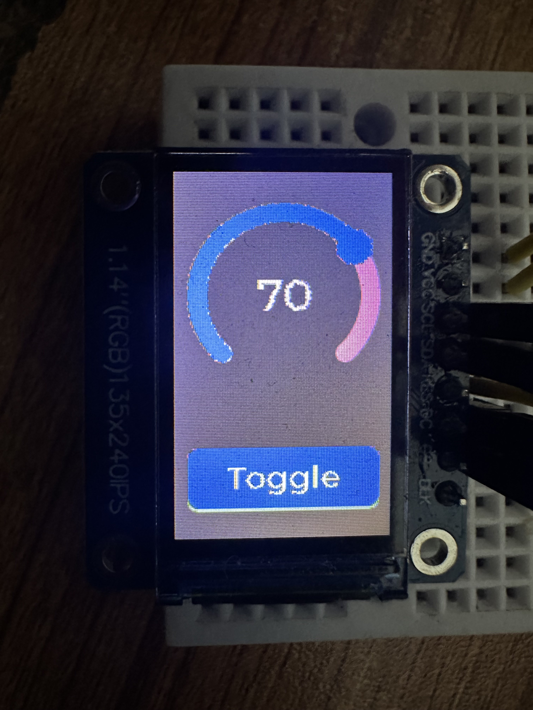

# STM32F4_lvgl

## Project Description
This is an example project demonstrating how to get started with LVGL (Light and Versatile Graphics Library) on STM32 microcontrollers.

---

## Hardware Requirements
1. **STM32F446RE Nucleo Board** (or any other STM32F4 board).  
2. **TFT Display** with ST7789 Driver (Other drivers like ST7735 or ILI9341 can also be used).  
3. **Jumper Wires** for connections.  
4. **Push Button** (if your board lacks a built-in user button).  
5. **Logic Analyzer** (optional, for debugging the SPI bus).  

---

## Adding LVGL Library to Your Project

To add LVGL to your project, follow these steps:  
1. Clone the official LVGL GitHub repository:  
```bash
git clone https://github.com/lvgl/lvgl.git
```
2. In your project tree make a file named `lv_conf.h` or rename the provided `lv_conf_template.h` file from lvgl directory
   
3. Set Which Display Driver you Want to use in `lv_conf.h` in case you have the supproted one 
```c
#define LV_USE_ST7735        0
#define LV_USE_ST7789        1
#define LV_USE_ST7796        0
#define LV_USE_ILI9341       0
```
    Here I am using ST7789 so I set it to `1` 
4. Implement these two function so that lvgl can send Data and Command to your display (These can vary depending on which MCU you are using)
```c
void my_lcd_send_cmd(lv_display_t *disp, const uint8_t *cmd, size_t cmd_size, const uint8_t *param, size_t param_size)
{
    /* DCX low (command) */
    LCD_DC_LOW();

    /* CS low */
    CS_Enable();

    /* send command */
    SPI_MasterTransmit(SPI1, (uint8_t *)cmd, cmd_size);

    /* DCX high (data) */
    LCD_DC_HIGH();

    /* for short data blocks we use polling transfer */
    SPI_MasterTransmit(SPI1, (uint8_t *)param, param_size);

    /* CS high */
    CS_Disable();
}
```

```c
void my_lcd_send_color(lv_display_t *disp, const uint8_t *cmd, size_t cmd_size, uint8_t *param, size_t param_size)
{
    /* DCX low (command) */
    LCD_DC_LOW();

    /* CS low */
    CS_Enable();

    /* send command */
    SPI_MasterTransmit(SPI1, (uint8_t *)cmd, cmd_size);

    /* DCX high (data) */
    LCD_DC_HIGH();

    /*Sending Data*/
    SPI_MasterTransmit(SPI1, (uint8_t *)param, param_size);

    /* CS high */
    CS_Disable();
    lv_disp_flush_ready(disp);
}
```
5. You need to configure a timer so that lvgl can use time to update the display periodically 
```c
void TIM2_IRQHandler()
{
    // Check if the update interrupt flag is set
    if (TIM2->SR & TIM_SR_UIF)
    {
        // Clear the update interrupt flag
        TIM2->SR &= ~TIM_SR_UIF;

        // Increment LVGL tick by 1ms
        lv_tick_inc(1);
    }
}
```

---
## The final output of the project will look similar to this:


